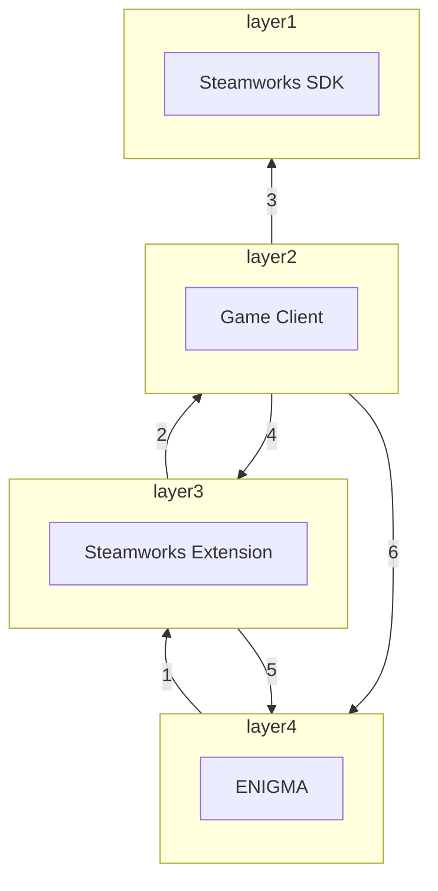
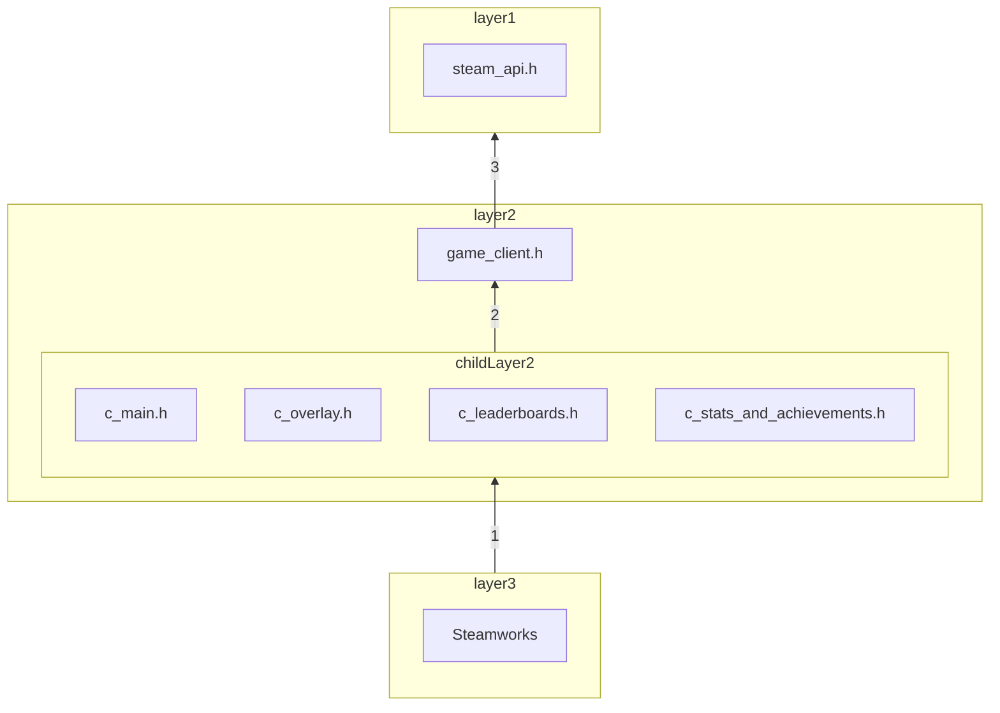

# ENIGMA's Steamworks Extension

Steamworks is a set of tools and services that help game developers and publishers build their games and get the most out of distributing on Steam.
This extension was part of [Google Summer of Code 2023 project](https://summerofcode.withgoogle.com/programs/2023/projects/kHDskccO). Reach out to
me on ENIGMA's official Discord server.

## Supported Platforms

 - Ubuntu Linux.

## Building Steamworks Extension for Ubuntu Linux


## Steamworks Extension's Structure

```bash
Steamworks
├── game_client
│   ├── SteamvXXX
│   │   └── sdk
│   │       ├── public
│   │       │   └── *
│   │       ├── redistributable_bin
│   │       │   └── *
│   │       └── Readme.txt
│   ├── utils
│   │   ├── *.cpp
│   │   └── *.h
│   ├── .gitignore
│   ├── *.cpp
│   └── *.h
├── steamworks_demo
│   ├── *
│   └── demo.project.gmx
├── .gitignore
├── About.ey
├── implement.h
├── include.h
├── CMakelists.txt
├── Makefile
├── README.md
├── setup_linux.sh
├── *.svg
├── *.cpp
└── *.h
```

   - `Steamworks/game_client/SteamvXXX/` is the 1rd layer of the extension. It is the Steamworks SDK.
   - `Steamworks/game_client/` is the 2nd layer of the extension. It contains the code that is directly calls the Steamworks API functions.
   - `Steamworks/` is the 3rd layer of the extension. It is the extension itself.
   - Anything outside of `Steamworks` is considered part of the 4th layer that depends on Steamworks' extension.


## Steamworks Extension's Dependency Diagram



   - Dependency 1: ENIGMA depends on Steamworks extension by (This is normal dependency as Steamworks extension is a part of ENIGMA):
      - Including `Steamworks/implement.h` inside `enigma-dev/ENIGMAsystem/SHELL/Platforms/General/PFmain.cpp`.

   - Dependency 2: Steamworks extension depends on Game Client by:
      - Including `Steamworks/game_client/c_main.h` inside `Steamworks/general.h`.
      - Including `Steamworks/game_client/c_main.h` inside `Steamworks/leaderboards.h`.
      - Including `Steamworks/game_client/c_main.h` inside `Steamworks/management.cpp`.
      - Including `Steamworks/game_client/c_main.h` inside `Steamworks/overlay.h`.
      - Including `Steamworks/game_client/c_main.h` inside `Steamworks/stats_and_achievements.h`.
      - Including `Steamworks/game_client/c_main.h` inside `Steamworks/steamworks.cpp`.
      - Including `Steamworks/game_client/c_overlay.h` inside `Steamworks/overlay.cpp`.
      - Including `Steamworks/game_client/c_stats_and_achievements.h` inside `Steamworks/general.cpp`.
      - Including `Steamworks/game_client/c_stats_and_achievements.h` inside `Steamworks/stats_and_achievements.cpp`.
      - Including `Steamworks/game_client/c_leaderboards.h` inside `Steamworks/leaderboards.cpp`.

   - Dependency 3: Game Client depends on Steamworks SDK by:
      - Including `steam/steam_api.h` inside `Steamworks/game_client/game_client.h`.

   - Dependency 4: Game Client depends on Steamworks extension by:
      - Including `Steamworks/leaderboards.h` inside `Steamworks/game_client/utils/c_leaderboard_find_result_cookies.cpp`.
      - Including `Steamworks/leaderboards.h` inside `Steamworks/game_client/utils/c_leaderboard_score_downloaded_cookies.cpp`.
      - Including `Steamworks/leaderboards.h` inside `Steamworks/game_client/utils/c_leaderboard_score_uploaded_cookies.cpp`.

   - Dependency 5: Steamworks extension depends on ENIGMA by (This is normal dependency as Steamworks extension is a part of ENIGMA):
      - Including `Universal_System/../Platforms/General/PFmain.h` inside `Steamworks/leaderboards.cpp`.
      - Including `Universal_System/Resources/AssetArray.h` inside `Steamworks/leaderboards.h`.

   - Dependency 6: Game Client depends on ENIGMA by (This is abnormal dependency as Game Client is a part of Steamworks extension):
      - Including `Widget_Systems/widgets_mandatory.h` inside `Steamworks/game_client/game_client.h`.

If we will convert the above dependencies to a diagram, it will look like this:



## Steamworks Extension's Shared Resources Handling

Steamworks extension writes to `posted_async_events` queue inside `Platforms/General/PFmain.h` using Async callbacks
while the main game loop is reading the same shared queue.

These are my critical sections:
 - `Steamworks/leaderboards.cpp` inside `enigma::push_create_leaderboard_steam_async_event()` function.
 - `Steamworks/leaderboards.cpp` inside `enigma::push_leaderboard_upload_steam_async_event()` function.
 - `Steamworks/leaderboards.cpp` inside `enigma::push_leaderboard_download_steam_async_event()` function.

## Integrating New Version of Steamworks SDK

 1. Create a new version directory inside `Steamworks/game_client/`,
 2. Download the new version of Steamworks SDK and extract it.
 3. Copy only the `sdk` directory to `Steamworks/game_client/SteamvXXX/`.
 4. Modify `Steamworks/Makefile` to point to the newer Steamworks SDK.
 5. [Skip this step] Modify `Steamworks/CMakelists.txt` to point to the newer Steamworks SDK.
 6. Add the new libraries to git inside `Steamworks/game_client/.gitignore` Leaving the old ones there.
 7. Run the demo to make sure everything is working fine.

## TODO

TODO: Fill here the work that is left to be done.
TODO: Create an error channel to report errors to Steamworks layer.


