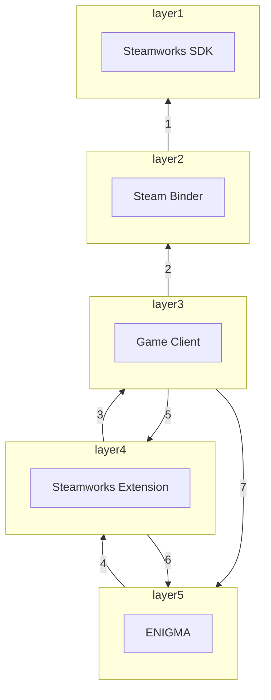
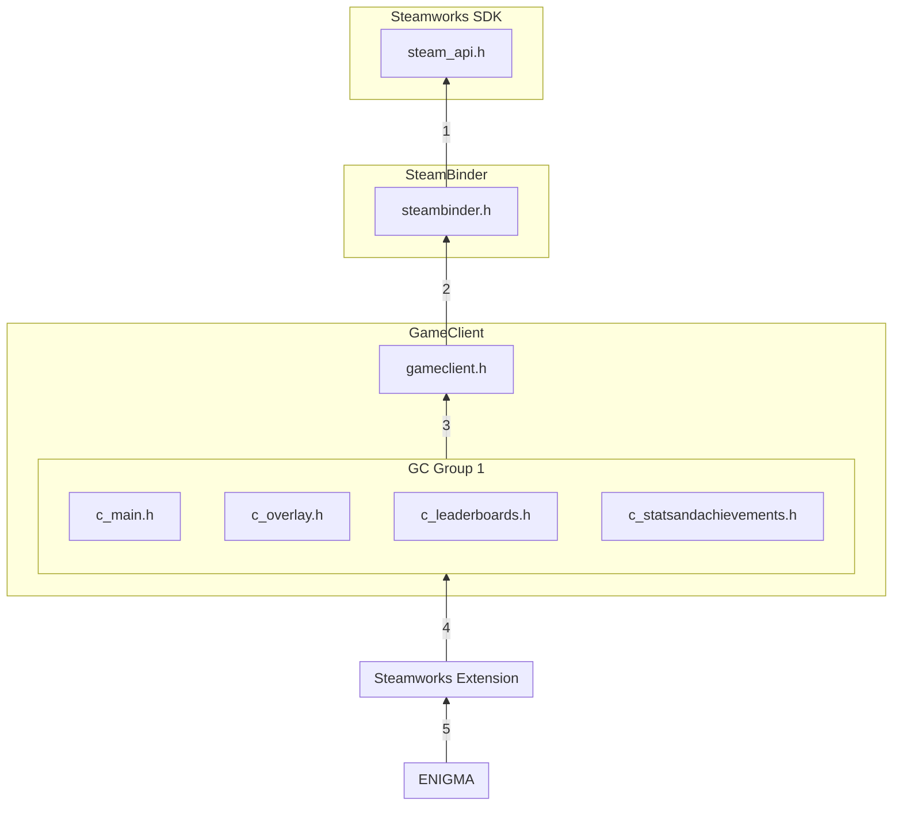

# ENIGMA's Steamworks Extension

Steamworks is a set of tools and services that help game developers and publishers build their games and get the most out of distributing on Steam.
This extension was part of [Google Summer of Code 2023 project](https://summerofcode.withgoogle.com/programs/2023/projects/kHDskccO). Reach out to
me on ENIGMA's official Discord server.

## Supported Platforms

 - Ubuntu Linux.

## Building Steamworks Extension for Ubuntu Linux 64-bit

1. Download [Steam](https://store.steampowered.com/about/download).
2. Download [Steamworks SDK v157](https://partner.steamgames.com/downloads/steamworks_sdk_157.zip).
3. Unzip the Steamworks SDK.
4. Copy the `redistributable_bin/` directory to `enigma-dev/ENIGMAsystem/SHELL/Universal_System/Extensions/Steamworks/gameclient/steambinder/Steamv157/sdk/`.
5. [An alternative to step 4] Set the `STEAM_SDK_PATH` environment variable to the path of the `sdk/` directory in your unzipped Steamworks SDK by appending this line inside `.bashrc`.
```bash
cd ~
```
```bash
vim .bashrc
```
```bash
export STEAM_SDK_PATH=/path/to/steamworks/sdk
```
6. Find the path to your `gameoverlayrenderer.so` file:
```
find ~ -name gameoverlayrenderer.so
```
7. Now modify the `.bashrc` again and append these two lines (DON'T forget to change the path to your `gameoverlayrenderer.so` file):
 - 64-bit
```bash
export LD_LIBRARY_PATH=~/Desktop/enigma-dev/ENIGMAsystem/SHELL/Universal_System/Extensions/Steamworks/gameclient/steambinder/Steamv157/sdk/redistributable_bin/linux64:${LD_LIBRARY_PATH}

export LD_PRELOAD=/path/to/ubuntu12_64/gameoverlayrenderer.so:${LD_PRELOAD}
```
 - 32-bit
```bash
export LD_LIBRARY_PATH=~/Desktop/enigma-dev/ENIGMAsystem/SHELL/Universal_System/Extensions/Steamworks/gameclient/steambinder/Steamv157/sdk/redistributable_bin/linux32:${LD_LIBRARY_PATH}

export LD_PRELOAD=/path/to/ubuntu12_32/gameoverlayrenderer.so:${LD_PRELOAD}
```
8. Enable the Steamworks and Json extensions inside the IDE (LGM/RGM).
9. Run the demo to make sure everything is working fine `enigma-dev/ENIGMAsystem/SHELL/Universal_System/Extensions/Steamworks/steamworks_demo/demo.project.gmx`.

## Building Steamworks Extension for Windows 64-bit

```
Note: Windows support will be postponed due to an ABI issue as ENIGMA doesn't support MSVC yet, I recommend using Ubuntu Linux - 20/06/2023 00:45
```

```
Note: Currently, the Steam Binder doesn't support Windows.
```

1. Download [Steam](https://store.steampowered.com/about/download).
2. Download [Steamworks SDK v157](https://partner.steamgames.com/downloads/steamworks_sdk_157.zip).
3. Unzip the Steamworks SDK.
4. Copy the `redistributable_bin\` directory to `enigma-dev\ENIGMAsystem\SHELL\Universal_System\Extensions\Steamworks\gameclient\steambinder\Steamv157\sdk\`.
5. [An alternative to step 4] Set the `STEAM_SDK_PATH` environment variable to the path of the `sdk` directory in your unzipped Steamworks SDK (Note that if you used this step, you will have to run LGM/RGM from the same terminal):
```bash
STEAM_SDK_PATH="\path\to\steamworks\sdk"
```
6. Copy the `steam_api64.dll` from `enigma-dev\ENIGMAsystem\SHELL\Universal_System\Extensions\Steamworks\gameclient\steambinder\Steamv157\sdk\redistributable_bin\win64\` and then paste it into `C:\msys64\tmp\` directory. This must be done as LGM exports the executable in that location and we need that DLL to be with the executable.
7. Enable the Steamworks and Json extensions inside the IDE (LGM/RGM).
8. Run the demo to make sure everything is working fine `enigma-dev\ENIGMAsystem\SHELL\Universal_System\Extensions\Steamworks\steamworks_demo\demo.project.gmx`.

## Steamworks Extension's Structure

```bash
Steamworks               <------- 4th layer
├── gameclient              <------- 3rd layer
│   ├── steambinder            <------- 2nd layer
│   │   ├── SteamFake            <------- Fake 1st layer
│   │   │   └── sdk
│   │   │       ├── public
│   │   │       │   └── steam
│   │   │       │       ├── *.h
│   │   │       │       └── *.cpp
│   │   │       │
│   │   │       └── Readme.txt
│   │   │
│   │   ├── SteamvXXX            <------- Real 1st layer
│   │   │   └── sdk
│   │   │       ├── public
│   │   │       │   └── steam
│   │   │       │       └── *.h
│   │   │       │
│   │   │       └── Readme.txt
│   │   │
│   │   ├── .gitignore
│   │   ├── steambinder.h
│   │   └── steambinder.cpp
│   │
│   ├── utils
│   │   ├── *.h
│   │   └── *.cpp
│   │
│   ├── gameclient.h
│   ├── gameclient.cpp
│   ├── *.h
│   └── *.cpp
│
├── steamworks_demo
│   ├── *
│   └── demo.project.gmx
│
├── .gitignore
├── About.ey
├── implement.h
├── include.h
├── CMakelists.txt
├── Makefile
├── README.md
├── *.svg
├── steamworks.h
├── steamworks.cpp
├── *.h
└── *.cpp
```

   -  `Steamworks/gameclient/steambinder/SteamvXXX/` and `Steamworks/gameclient/steambinder/SteamFake/` is the 1rd layer of the 
      extension. It is the Steamworks SDK.
   -  `Steamworks/steambinder/` is the 2nd layer of the extension. It contains the code that binds the Steamworks SDK to the extension.
   -  `Steamworks/gameclient/` is the 3rd layer of the extension. It contains the code that is directly calls the Steamworks API functions.
   -  `Steamworks/` is the 4th layer of the extension. It is the extension itself. 
   -  Anything outside of `Steamworks` is considered part of the 5th layer that depends on Steamworks' extension.


## Steamworks Extension's Dependency Diagram


   - Dependency 1: Steam Binder depends on Steamworks SDK by:
      - Including `steam/steam_api.h` inside `Steamworks/gameclient/steambinder/steambinder.h`.
      - Including `steam/steam_api_flat.h` inside `Steamworks/gameclient/steambinder/steambinder.h`.

   - Dependency 2: Game Client depends on Steam Binder by:
      - Including `Steamworks/gameclient/steambinder/steambinder.h` inside `Steamworks/gameclient/gameclient.h`.

   - Dependency 3: Steamworks extension depends on Game Client by:
      - Including `Steamworks/gameclient/gc_main.h` inside `Steamworks/general.h`.
      - Including `Steamworks/gameclient/gc_main.h` inside `Steamworks/leaderboards.h`.
      - Including `Steamworks/gameclient/gc_main.h` inside `Steamworks/management.cpp`.
      - Including `Steamworks/gameclient/gc_main.h` inside `Steamworks/overlay.h`.
      - Including `Steamworks/gameclient/gc_main.h` inside `Steamworks/statsandachievements.h`.
      - Including `Steamworks/gameclient/gc_main.h` inside `Steamworks/steamworks.cpp`.
      - Including `Steamworks/gameclient/gc_overlay.h` inside `Steamworks/overlay.cpp`.
      - Including `Steamworks/gameclient/gc_statsandachievements.h` inside `Steamworks/general.cpp`.
      - Including `Steamworks/gameclient/gc_statsandachievements.h` inside `Steamworks/statsandachievements.cpp`.
      - Including `Steamworks/gameclient/gc_leaderboards.h` inside `Steamworks/leaderboards.h`.

   - Dependency 4: ENIGMA depends on Steamworks extension by (This is normal dependency as Steamworks extension is a part of ENIGMA):
      - Including `Steamworks/steamworks.h` inside `enigma-dev/ENIGMAsystem/SHELL/Platforms/General/PFmain.cpp`.

   - Dependency 5: Game Client depends on Steamworks extension by:
      - Including `Steamworks/leaderboards.h` inside `Steamworks/gameclient/utils/gc_leaderboards_cookies.h`.

   - Dependency 6: Steamworks extension depends on ENIGMA by (This is normal dependency as Steamworks extension is a part of ENIGMA):
      - Including `Universal_System/../Platforms/General/PFmain.h` inside `Steamworks/leaderboards.cpp`.
      - Including `Universal_System/Resources/AssetArray.h` inside `Steamworks/leaderboards.h`.

   - Dependency 7: Game Client depends on ENIGMA by (This is abnormal dependency as Game Client is a part of Steamworks extension):
      - Including `Widget_Systems/widgets_mandatory.h` inside `Steamworks/gameclient/gameclient.h`.

If we will convert the above dependencies to a diagram, it will look like this:



## Steamworks Extension's Shared Resources Handling

Steamworks extension writes to `posted_async_events` queue inside `Platforms/General/PFmain.h` using Async callbacks
while the main game loop is reading the same shared queue.

These are my critical sections:
 - `Steamworks/leaderboards.cpp` inside `enigma::push_create_leaderboard_steam_async_event()` function.
 - `Steamworks/leaderboards.cpp` inside `enigma::push_leaderboard_upload_steam_async_event()` function.
 - `Steamworks/leaderboards.cpp` inside `enigma::push_leaderboard_download_steam_async_event()` function.

## Integrating New Version of Steamworks SDK

 1. Create a new version directory inside `Steamworks/gameclient/`,
 2. Download the new version of Steamworks SDK and extract it.
 3. Copy only the `sdk` directory to `Steamworks/gameclient/steambinder/SteamvXXX/`.
 4. Modify `Steamworks/Makefile` to point to the newer Steamworks SDK.
 5. [Skip this step] Modify `Steamworks/CMakelists.txt` to point to the newer Steamworks SDK.
 6. Add the new libraries to git inside `Steamworks/gameclient/steambinder/.gitignore` Leaving the old ones there.
 7. Run the demo to make sure everything is working fine.

## Incompatibility with GMS

1. ``steam_activate_overlay_user();`` function
 - GMS:
```c++
steam_activate_overlay_user(string dialog_name, int64 steamid);
```

 - ENIGMA
```c++
steam_activate_overlay_user(int dialog, int64 steamid);
```

dialog constants:
 - `user_ov_steamid`
 - `user_ov_chat`
 - `user_ov_jointrade`
 - `user_ov_stats`
 - `user_ov_achievements`
 - `user_ov_friendadd`
 - `user_ov_friendremove`
 - `user_ov_friendrequestaccept`
 - `user_ov_friendrequestignore`

2. The user can set the maximum leaderboard entries to display using the user variable: ``lb_max_entries``.

3. steam_set_rich_presence();
 - GMS: Returns ``void``
 - ENIGMA: Returns ``bool``
