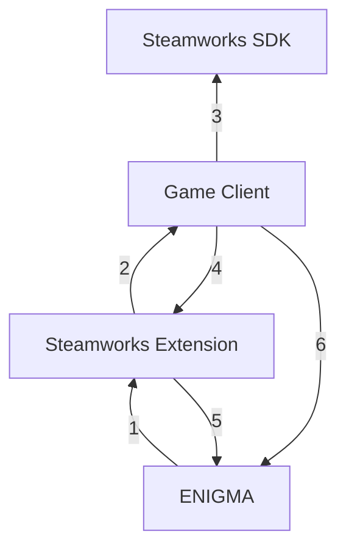

## Steamworks Extension's Structure

```mermaid
flowchart BT

    %% This is the normal dependency of ENIGMA on the
    %% Steamworks extension.
    Layer4[ENIGMA] --> |1| Layer3[Steamworks Extension]

    %% This is the normal dependency of Steamworks
    %% extension on Game Client.
    Layer3 --> |2| Layer2

    %% This is the normal dependency of Game Client
    %% on Steamworks SDK.
    Layer2[Game Client] --> |3| Layer1[Steamworks SDK]

    %% Game Client can depend on the Steamworks extension
    %% for calling functions that sends data to the
    %% Async system.
    Layer2 --> |4| Layer3

    %% Steamworks extension can depend on the ENIGMA
    %% for sending data to Async system.
    Layer3 --> |5| Layer4

    %% This is the only allowed abnormal dependency of  
    %% Game Client on ENIGMA. This is for sending
    %% debug messages from Game Client layer to the
    %% console.
    Layer2 --> |6| Layer4
```

